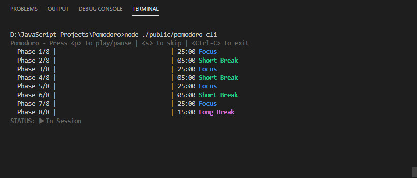
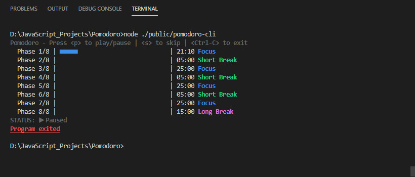
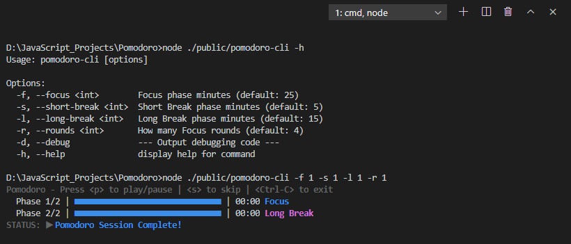

# Pomodoro-CLI



<p align="center">Pomodoro with default settings</p>

<br>


<p align="center">Paused Pomodoro session</p>

<br>


<p align="center">Pomodoro with custom settings</p>

<br>

## What is this?

A Pomodoro Timer with a CLI

## Installation

```
npm i skyacemike-pomodoro-cli -g
```

## Usage

The "node" argument should be uneeded for Linux!
```
pomodoro-cli node
```

## Controls

Press \<p> to play/pause | \<s> to skip | \<Ctrl-C> to exit

## Options

```
Usage: pomodoro-cli [options]

Options:
  -f, --focus <int>        Focus phase minutes (default: 25)
  -s, --short-break <int>  Short Break phase minutes (default: 5)
  -l, --long-break <int>   Long Break phase minutes (default: 15)
  -r, --rounds <int>       How many Focus rounds (default: 4)
  -d, --debug              --- Output debugging code ---
  -h, --help               display help for command
```

## Modifications

The pomodoro-cli.js file was written to be easy to read and modify

It has 333 lines of commented code (as of 12/19/2020)

You could:
- Add a new command or option within `program.option()`
- Write a custom callback within `sessionCompleteCallback`
- Change the interface colors within `STYLES`
- Rewrite the progress bar format within `PROGRESS_BAR.FORMAT`
- Customize the progress bar styling within ```cliProgress.Multibar```

## Dependencies
- [Chalk](https://github.com/chalk/chalk) --> (Colors in terminal)
- [Commander.js](https://github.com/tj/commander.js) --> (Handles CLI arguments)
- [Node.CLI-Progress](https://github.com/AndiDittrich/Node.CLI-Progress) --> (Progress bars)
